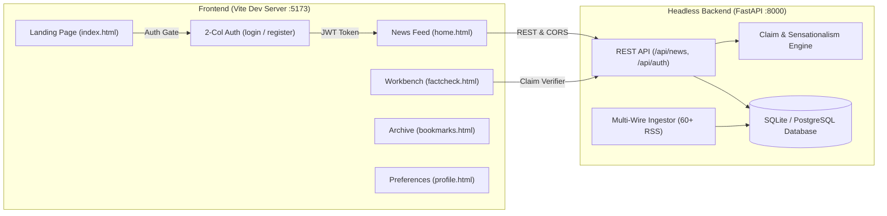

# 📰 Samachar — Autonomous Truth-First News Intelligence Network

[](https://github.com/OK45batwal/samachar-news)
[](https://fastapi.tiangolo.com)
[](https://vitejs.dev)
[](https://python.org)

**Samachar** is an autonomous news intelligence network engineered to restore factual clarity to digital journalism. It continuously ingests and triangulates raw dispatches from **60+ accredited international, national, and scientific wire services**, strips hyperbolic clickbait, decomposes complex articles into atomic claims, and computes transparent **0–100% Truth Scorecards**.

---

## 🌟 Key Highlights & Capabilities

### 1. ⚡ 4-Stage Autonomous Truth Pipeline
- **Continuous Multi-Wire Ingestion**: Streams dispatches every 30 minutes from Reuters, Associated Press, BBC News, Bloomberg, Nature Journal, PTI, and The Hindu with zero human editorial bias.
- **Semantic Clustering & Entity Triangulation**: Corroborates breaking events across multiple independent newsrooms.
- **Sensationalism & Adjective Penalty Engine**: Detects emotional hyperbole and uncredited assertions, deducting up to 40% from the credibility index.
- **Atomic Claim Decomposition**: Breaks stories into verified assertions, quotes, and primary evidence citations.

### 2. 🛡️ Authentication Gate & One-Click Demo Access
- **Protected News Portal**: Visitors on the public landing page are guided through an authentication guard before accessing live feeds.
- **1-Click Instant Demo Login**: One tap automatically authenticates as a pre-configured reader (`reader@samachar.news` / `ReaderPass123!`) or Chief Editor (`admin@samachar.news` / `AdminPass123!`).
- **Interactive Password Visibility Toggles**: Custom show/hide eye buttons (`👁️`) with client-side form validation.

### 3. 🎨 High-Taste Obsidian UI/UX (TasteSkill Design Tokens)
- **Design Tokens**: Obsidian Dark (`#08090C`) and Editorial Light modes with Emerald Glow accents (`#00F59B`).
- **Bento Grid Hero Layout**: Spotlight lead stories with real-time credibility metrics and wire attribution tags.
- **Interactive Workbench (`factcheck.html`)**: Instant in-page claim verifier with sample tests (`#MalariaVaccine`, `#1.4nmChips`, `#ClickbaitTest`).
- **Encrypted Bookmarks Archive (`bookmarks.html`)**: Saved reading lists with one-tap removal.
- **User Preference Center (`profile.html`)**: Custom truth thresholds, edition switchers, and reading stats.

---

## 🏛️ System Architecture



---

## 🚀 Quickstart & Setup

### Prerequisites
- **Python 3.11+** (Python 3.14 recommended)
- **Node.js 18+** & **npm**

### 1. Clone the Repository
```bash
git clone https://github.com/OK45batwal/samachar-news.git
cd samachar-news
```

### 2. Backend Setup & Run (Port 8000)
```bash
# Create & activate virtual environment
python3 -m venv .venv
source .venv/bin/activate

# Install dependencies
pip install -r requirements.txt

# Seed initial verified stories & admin users
python3 -m backend.seed

# Start FastAPI server
uvicorn backend.app:app --reload --port 8000
```
- **Backend API**: `http://localhost:8000/api`
- **Interactive OpenAPI Docs**: `http://localhost:8000/docs`

### 3. Frontend Setup & Run (Port 5173)
```bash
# Install frontend dependencies
npm install

# Start Vite development server
npm run dev
```
- **Public Landing Page**: `http://localhost:5173/index.html`
- **Sign In (1-Click Demo)**: `http://localhost:5173/login.html`
- **Live News Portal**: `http://localhost:5173/home.html`
- **Fact-Checking Tool**: `http://localhost:5173/factcheck.html`

---

## 🔑 Pre-Configured Demo Credentials

| Role | Email | Password | Access Level |
|---|---|---|---|
| **Verified Reader** | `reader@samachar.news` | `ReaderPass123!` | Read live feeds, bookmark articles, run fact checks |
| **Chief Editor (Admin)** | `admin@samachar.news` | `AdminPass123!` | Full editorial dashboard, manual ingestion triggers |

---

## 🧪 Comprehensive Verification & Test Suite

Run the end-to-end verification pipeline (UI page audit, backend pytest, Vite production build):

```bash
npm test
```

### Individual Test Commands
```bash
# 1. Run 12 Backend unit & integration test suites
pytest tests/ -v

# 2. Run UI/UX structure & link audit across all 13 HTML pages
npm run audit:ui

# 3. Compile Vite production bundle
npm run build
```

---

## 📁 Repository Structure

```
samachar-news/
├── backend/
│   ├── ai/               # Fact-checking NLP, claim extractor & credibility engine
│   ├── api/              # FastAPI router endpoints (auth, news, admin, factcheck)
│   ├── models/           # SQLAlchemy database schemas (User, Article, Source, Bookmark)
│   ├── services/         # Rate limiting, ingestion jobs, and feed collectors
│   ├── app.py            # Headless FastAPI application & CORS configuration
│   ├── config.py         # App settings & JWT security parameters
│   └── seed.py           # Database seeder with benchmark stories
├── frontend/
│   ├── assets/
│   │   ├── css/          # TasteSkill tokens (variables.css, layout.css, style.css)
│   │   ├── js/           # Resilient API client (api.js), layout controller (layout.js)
│   │   └── icons/        # SVG brand assets & favicons
│   ├── index.html        # Public marketing landing page & in-page fact verifier
│   ├── home.html         # Main authenticated news dashboard & bento hero
│   ├── latest.html       # Channel feeds (World, Tech & AI, India, Business, etc.)
│   ├── factcheck.html    # Interactive claim verification workbench
│   ├── login.html        # 2-column split-screen sign in with 1-Click demo
│   ├── register.html     # 2-column split-screen registration
│   ├── bookmarks.html    # Saved reading list & research archive
│   ├── profile.html      # User preferences, reading stats, & edition filter
│   ├── article.html      # Article view with truth scorecard & audio reader
│   ├── trending.html     # High-engagement verified stories
│   ├── about.html        # 4-stage pipeline & credibility index spectrum
│   └── admin.html        # Editorial management & wire health dashboard
├── tests/                # Automated pytest suites for auth, fact-checking & API
└── package.json          # Vite bundler, scripts, and UI audit runner
```

---

## 📜 License

Distributed under the **MIT License**. Engineered with precision for absolute factual clarity.
