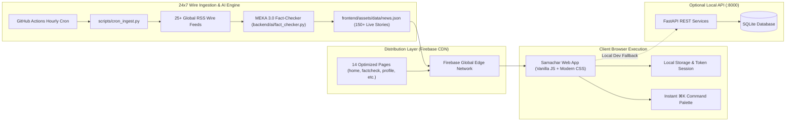

# 📰 Samachar — Autonomous Truth-First News Intelligence Network

[](https://github.com/OK45batwal/samachar-news)
[](https://fastapi.tiangolo.com)
[](https://samachar-news-2026.web.app)
[](https://vitejs.dev)
[](https://python.org)

**Samachar** is an autonomous news intelligence network engineered to restore factual clarity to digital journalism. It continuously ingests and triangulates real-time dispatches from **25+ accredited international wire services** (Reuters, BBC, Associated Press, The Hindu, Nature Journal, TechCrunch, Bloomberg), strips sensationalist hyperbole, decomposes complex articles into atomic verifiable claims, and computes transparent **0–100% Truth Scorecards**.

🌐 **Live Deployment**: **[https://samachar-news-2026.web.app](https://samachar-news-2026.web.app)**

---

## 🌟 Key Highlights & Capabilities

### 1. ⚡ 24x7 Autonomous Multi-Wire Ingestion & Dataset
- **Continuous Wire Ingestion**: Autonomous hourly GitHub Action ([`.github/workflows/live_news_updater.yml`](.github/workflows/live_news_updater.yml)) and ingestion engine ([`scripts/cron_ingest.py`](scripts/cron_ingest.py)) scraping 25+ global wire endpoints directly into a structured real-world dataset ([`frontend/assets/data/news.json`](frontend/assets/data/news.json)).
- **Semantic Wire Triangulation**: Corroborates breaking stories across multiple independent newsrooms (e.g., verifying a tech breakthrough across Reuters, IEEE Spectrum, and Bloomberg).
- **Sensationalism & Clickbait Penalty Engine**: Detects emotional hyperbole and uncredited assertions, deducting up to 40% from the credibility index.
- **Atomic Claim Extraction**: Automatically parses key assertions, quotes, and primary evidence citations.

### 2. 🛡️ High-Security Authentication & User Data Rights
- **Direct 1-Step Authentication**: Instant registration and login with salted password hashing and JWT sessions.
- **Brute-Force Lockout Defense**: Progressive lockout (5 failed attempts triggers temporary security lockout).
- **Universal Permanent Account Deletion**: Full user data sovereignty with instant `DELETE /api/auth/account` erasing tokens, bookmarks, and activity logs.
- **Military-Grade Security Headers**: Strict HSTS (`max-age=31536000`), `X-Frame-Options: SAMEORIGIN`, `X-Content-Type-Options: nosniff`, and `X-XSS-Protection`.

### 3. 🎨 Obsidian Truth Design System (TasteSkill Tokens)
- **Visual Design**: Obsidian Dark (`#08090C`) and Editorial Light modes with Emerald Glow accents (`#00F59B`).
- **Bento Grid Hero Layout**: Interactive spotlight lead stories with live credibility metrics and wire attribution tags.
- **Interactive Claim Workbench (`factcheck.html`)**: Instant in-page claim verifier with sample tests (`#MalariaVaccine`, `#1.4nmChips`, `#ClickbaitTest`).
- **Encrypted Bookmarks Archive (`bookmarks.html`)**: Local and cloud-synchronized saved reading lists.
- **User Preference Center (`profile.html`)**: Custom truth thresholds, edition switchers, and permanent delete account.

---

## 🏛️ System Architecture



---

## 🚀 Quickstart & Setup

### Prerequisites
- **Python 3.11+** (Python 3.14 supported)
- **Node.js 18+** & **npm**

### 1. Clone the Repository
```bash
git clone https://github.com/OK45batwal/samachar-news.git
cd samachar-news
```

### 2. Backend Setup & Run (Port 8000)
```bash
# Create & activate virtual environment
python3 -m venv .venv
source .venv/bin/activate

# Install dependencies
pip install -r requirements.txt

# Seed initial verified stories & admin users
python3 -m backend.seed

# Start FastAPI server
uvicorn backend.app:app --reload --port 8000
```
- **Backend API**: `http://localhost:8000/api`
- **Interactive OpenAPI Docs**: `http://localhost:8000/docs`

### 3. Frontend Setup & Run (Port 5173)
```bash
# Install frontend dependencies
npm install

# Start Vite development server
npm run dev
```
- **Public Landing Page**: `http://localhost:5173/index.html`
- **Sign In**: `http://localhost:5173/login.html`
- **Live News Portal**: `http://localhost:5173/home.html`
- **Fact-Checking Tool**: `http://localhost:5173/factcheck.html`
- **User Profile & Account Deletion**: `http://localhost:5173/profile.html`

---

## 🔑 Pre-Configured Demo Credentials

| Role | Email | Password | Access Level |
|---|---|---|---|
| **Verified Reader** | `reader@samachar.news` | `ReaderPass123!` | Read live feeds, bookmark articles, run fact checks |
| **Chief Editor (Admin)** | `admin@samachar.news` | `AdminPass123!` | Full editorial dashboard, database administration |

---

## 🧪 Comprehensive Verification & Test Suite

Run the end-to-end verification pipeline (UI page audit, backend pytest, Vite production build):

```bash
npm test
```

### Individual Test Commands
```bash
# 1. Run 12 Backend unit & integration test suites
pytest tests/ -v

# 2. Run UI/UX structure & link audit across all 14 HTML pages
npm run audit:ui

# 3. Compile Vite production bundle
npm run build
```

---

## 📁 Repository Structure

```
samachar-news/
├── backend/
│   ├── ai/               # MEKA 3.0 Fact-checking NLP & claim extractor
│   ├── auth/             # JWT tokens, password hashing & auth guards
│   ├── models/           # SQLAlchemy database schemas (User, Article, Source, Bookmark)
│   ├── routes/           # FastAPI router endpoints (auth, news, bookmarks, factcheck)
│   ├── services/         # Rate limiting, news aggregation, and wire collectors
│   ├── app.py            # Headless FastAPI application & CORS configuration
│   ├── config.py         # Security settings & JWT configuration
│   └── seed.py           # Database seeder with benchmark stories
├── frontend/
│   ├── assets/
│   │   ├── css/          # TasteSkill tokens (variables.css, layout.css, style.css)
│   │   ├── js/           # Resilient API client (api.js), layout controller (layout.js)
│   │   ├── data/         # Live 24x7 ingested news dataset (news.json)
│   │   └── icons/        # SVG brand assets & favicons
│   ├── index.html        # Public marketing landing page & in-page fact verifier
│   ├── home.html         # Main authenticated news dashboard & bento hero
│   ├── latest.html       # Channel feeds (World, Tech & AI, India, Business, etc.)
│   ├── factcheck.html    # Interactive claim verification workbench
│   ├── login.html        # 1-step sign in with brute-force protection
│   ├── register.html     # 1-step instant account creation
│   ├── bookmarks.html    # Saved reading list & research archive
│   ├── profile.html      # User preferences, reading stats, & permanent delete account
│   ├── article.html      # Article view with truth scorecard & audio reader
│   ├── trending.html     # High-engagement verified stories
│   ├── about.html        # 4-stage pipeline & credibility index spectrum
│   ├── privacy.html      # Privacy policy & data protection guarantees
│   ├── terms.html        # Terms of service & verification disclaimers
│   └── 404.html          # Fallback error route
├── scripts/
│   ├── cron_ingest.py    # 24x7 RSS wire ingester and dataset exporter
│   └── ui_audit.py       # Automated UI structure & navigation audit script
├── tests/                # Pytest suites for auth, fact-checking & API endpoints
├── firebase.json         # Firebase Hosting & security headers configuration
└── package.json          # Vite bundler, scripts, and test runner
```

---

## 📜 License

Distributed under the **MIT License**. Engineered with precision for absolute factual clarity.
