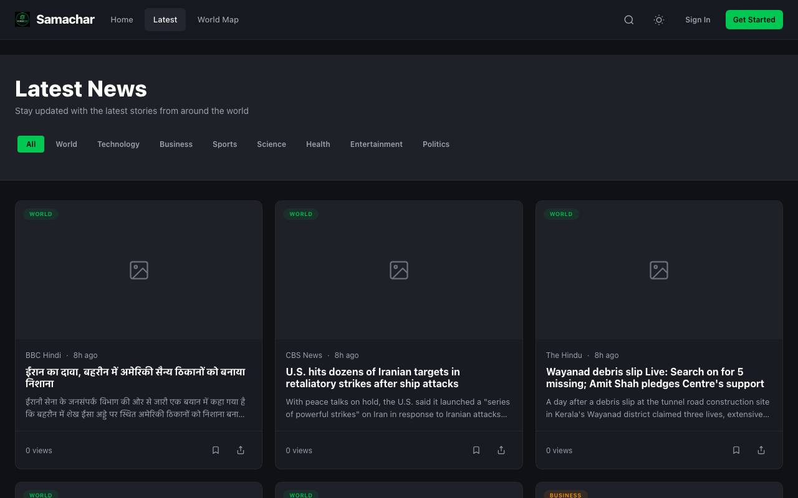
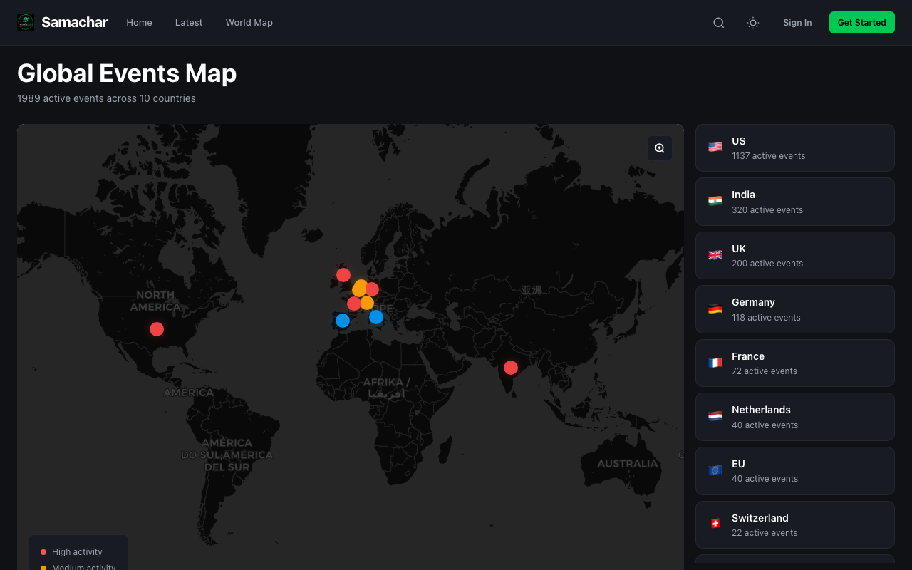
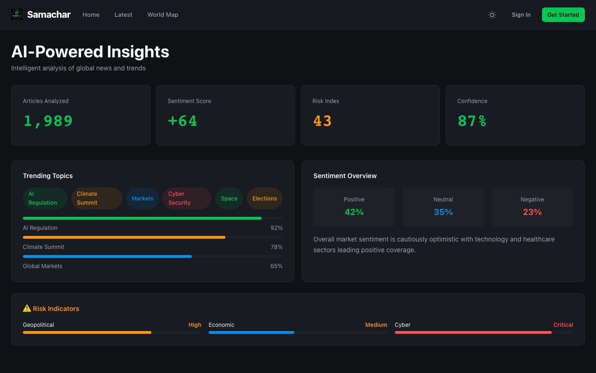
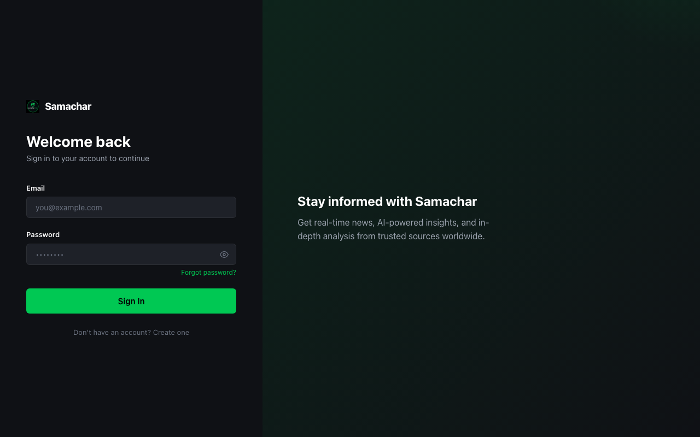

# Samachar News

> Real-time news intelligence platform — RSS ingestion, AI-powered insights, interactive world map.

<p align="center">
  
</p>

---

## Features

| | |
|---|---|
| **📰 Live News Feed** | 60+ RSS sources — BBC, Reuters, TechCrunch, ESPN, and more |
| **🧠 AI Insights** | Sentiment analysis, trending topics, personalised summaries |
| **🗺️ World Map** | Interactive Leaflet map with live event counts per country |
| **🔍 Smart Search** | Full-text search across all articles with instant results |
| **📌 Bookmarks** | Save articles to folders, organised by topic |
| **📖 Reading History** | Automatically tracks articles you've read |
| **🌓 Dark/Light Theme** | Persistent theme toggle across all pages |
| **🔐 Auth** | SuperTokens-based login/register with session management |
| **📱 Responsive** | Mobile-first layout, works on every screen size |

---

## Screenshots

| Home | Latest News |
|---|---|
|  |  |

| World Map | Article |
|---|---|
|  |  |

| AI Insights | Login |
|---|---|
|  |  |

---

## Tech Stack

**Backend** — FastAPI, SQLAlchemy, SuperTokens, Alembic, Prometheus, Sentry, structlog

**Frontend** — Vanilla HTML/CSS/JS, Vite, Leaflet, Chart.js

**Infra** — Docker, PostgreSQL, Redis, Render

---

## Local Dev

```bash
source .venv/bin/activate
uvicorn backend.app:app --reload --port 8000
# Open http://localhost:8000
```

### Seed & Ingest

```bash
python -m backend.seed                        # categories + sources
python -c "import asyncio; from backend.services.news_service import ingest_feeds; asyncio.run(ingest_feeds())"
```

### Tests

```bash
python -m pytest tests/ -v                    # unit + integration
npx playwright test tests/e2e/                # e2e (server must be running)
```

---

## One-Click Deploy

[](https://render.com/deploy?repo=https://github.com/OK45batwal/samachar-news)

Requires: `SUPERTOKENS_CONNECTION_URI`, `SAMACHAR_SECRET_KEY`, `CORS_ORIGINS`
