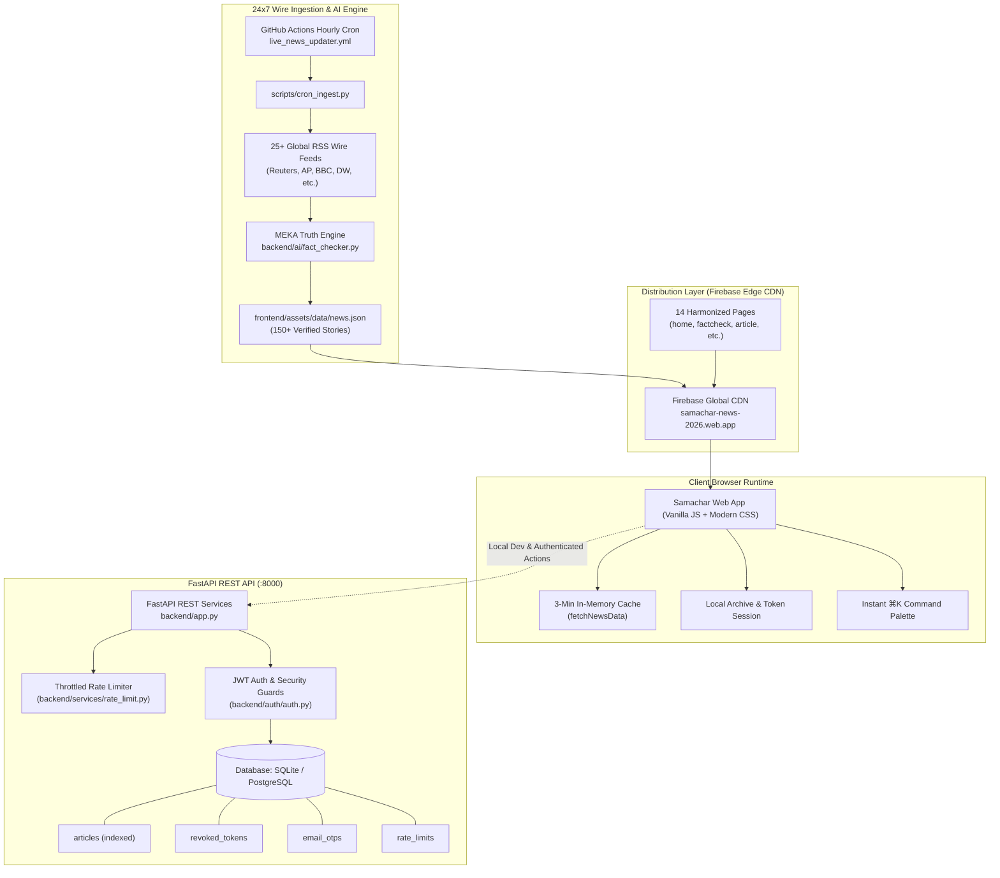

# 📰 Samachar — Autonomous Truth-First News Intelligence Network

[](https://github.com/OK45batwal/samachar-news)
[](https://fastapi.tiangolo.com)
[](https://samachar-news-2026.web.app)
[](https://vitejs.dev)
[](https://python.org)
[](https://github.com/OK45batwal/samachar-news)

**Samachar** is an autonomous news intelligence network engineered to restore factual clarity to digital journalism. It continuously ingests and triangulates real-time dispatches from **25+ accredited international wire services** (Reuters, BBC, Associated Press, The Hindu, Nature Journal, TechCrunch, Bloomberg, Deutsche Welle), strips sensationalist hyperbole, decomposes complex articles into atomic verifiable claims, and computes transparent **0–100% Truth Scorecards**.

🌐 **Live Deployment**: **[https://samachar-news-2026.web.app](https://samachar-news-2026.web.app)**  
📦 **Repository Remote**: **[https://github.com/OK45batwal/samachar-news](https://github.com/OK45batwal/samachar-news)**

---

## 🌟 Key Highlights & Capabilities

### 1. ⚡ 24x7 Autonomous Multi-Wire Ingestion & Dataset
- **Continuous Wire Ingestion**: Autonomous hourly GitHub Action ([`.github/workflows/live_news_updater.yml`](.github/workflows/live_news_updater.yml)) and ingestion pipeline ([`scripts/cron_ingest.py`](scripts/cron_ingest.py)) scraping 25+ global wire endpoints directly into a structured real-world dataset ([`frontend/assets/data/news.json`](frontend/assets/data/news.json)).
- **Semantic Wire Triangulation**: Corroborates breaking stories across multiple independent newsrooms (e.g., verifying a tech breakthrough across Reuters, IEEE Spectrum, and Bloomberg).
- **Sensationalism & Clickbait Penalty Engine**: Detects emotional hyperbole and uncredited assertions, deducting up to 40% from the credibility index.
- **Atomic Claim Extraction**: Automatically parses key assertions, quotes, and primary evidence citations for every article.

### 2. 🛡️ Enterprise Security & Hardened Architecture
- **Environment-Enforced Secret Validation**: Strict Pydantic startup validator preventing production boot if `SECRET_KEY` is missing or uses insecure defaults (`ENVIRONMENT=production`).
- **Database-Backed Token Revocation**: Revoked JWT tokens persist across server restarts in the `revoked_tokens` database table with sub-millisecond in-memory cache lookups.
- **Persistent Database OTP Verification**: Registration OTPs are stored with strict expiration timestamps in `email_otps`, eliminating memory leaks and cross-worker race conditions. Zero OTP leaks in API responses.
- **Production Auth Protection**: Strict separation between local developer simulation and production deployments, preventing client-side auth forgery.
- **SQL LIKE Wildcard Injection Defense**: Search inputs are sanitized via `_escape_like()` escaping `%`, `_`, and `\` before querying SQLite/PostgreSQL.
- **Write-Amplification Mitigation**: Database rate-limiter table cleanup is throttled to once per minute, eliminating SQLite locking overhead.
- **Military-Grade Security Headers**: Strict HSTS (`max-age=31536000`), `X-Frame-Options: SAMEORIGIN`, `X-Content-Type-Options: nosniff`, and `Permissions-Policy`.

### 3. 🎨 Minimalist Editorial Obsidian UI/UX
- **Editorial Aesthetic**: Inspired by high-credibility newsrooms (*Reuters*, *The Verge*, *Axios*, *The New York Times*). Deep obsidian `#0B0E14` and slate `#111622` surfaces with hairline borders (`rgba(255, 255, 255, 0.08)`).
- **Universal Masthead & Global Navigation**: 100% consistent across all 14 HTML pages with `SAMACHAR` branding, live keyboard shortcut (`⌘K`) search palette, and responsive channel pill bar.
- **Harmonized 4-Column Universal Footer**: Consistent navigation across News Desks, Fact-Checking Workbench, Legal policies, and accredited wire agency attribution.
- **Quiet News Cards with Direct Wire Outbound Links**: Standardized 16:9 imagery, subtle hover lifts, credibility badges, and direct `${source} ↗` primary reporting links.
- **High-Performance In-Memory Cache**: Client-side singleton cache with 3-minute TTL eliminates redundant ~500KB `news.json` fetches during page navigation.

---

## 🏛️ System Architecture



---

## 🚀 Quickstart & Setup

### Prerequisites
- **Python 3.11+** (Python 3.14 fully supported)
- **Node.js 18+** & **npm**

### 1. Clone the Repository
```bash
git clone https://github.com/OK45batwal/samachar-news.git
cd samachar-news
```

### 2. Environment Configuration
Copy the template and adjust secrets:
```bash
cp .env.example .env
```

### 3. Backend Setup & Run (Port 8000)
```bash
# Create & activate virtual environment
python3 -m venv .venv
source .venv/bin/activate

# Install dependencies
pip install -r requirements.txt

# Seed initial verified stories, sources, & admin users
python3 -m backend.seed

# Start FastAPI server
uvicorn backend.app:app --reload --port 8000
```
- **Backend API**: `http://localhost:8000/api`
- **Interactive OpenAPI Docs**: `http://localhost:8000/docs`
- **Alternative ReDoc**: `http://localhost:8000/redoc`

### 4. Frontend Setup & Run (Port 5173)
```bash
# Install frontend dependencies
npm install

# Start Vite development server
npm run dev
```
- **Public Landing Page**: `http://localhost:5173/index.html`
- **Live News Portal**: `http://localhost:5173/home.html`
- **Latest Dispatches**: `http://localhost:5173/latest.html`
- **Claim Verification Workbench**: `http://localhost:5173/factcheck.html`
- **Trending Stories**: `http://localhost:5173/trending.html`
- **Saved Bookmarks Archive**: `http://localhost:5173/bookmarks.html`
- **User Profile & Account Deletion**: `http://localhost:5173/profile.html`

---

## 🔑 Demo & Testing Credentials

| Role | Email | Password | Permissions |
|---|---|---|---|
| **Verified Reader** | `reader@samachar.news` | `ReaderPass123!` | Live news reading, bookmarking, fact-check tool, personal telemetry |
| **Chief Editor (Admin)** | `admin@samachar.news` | `AdminPass123!` | Full editorial dashboard, feed sync trigger, database administration |

---

## 🧪 Verification & Test Suite

Run the entire end-to-end verification pipeline (UI structure audit, 19 pytest backend unit/integration tests, and Vite production bundle):

```bash
npm test
```

### Individual Validation Commands
```bash
# 1. Run all 19 backend unit & integration tests
.venv/bin/pytest tests/ -v

# 2. Run UI/UX structure & link audit across all 14 HTML pages
npm run audit:ui

# 3. Test Vite production bundle compilation
npm run build
```

### Test Coverage Highlights
- `test_password_hashing`: Bcrypt password salt & verification.
- `test_jwt_create_and_decode`: Cryptographic token signing & claim validation.
- `test_logout_revokes_token`: Persistent database token revocation on logout.
- `test_sensationalism_clickbait_detection`: NLP penalty scoring for clickbait phrasing.
- `test_claim_extraction`: Regex & syntactic assertion extraction.
- `test_search_like_wildcard_escaping`: LIKE wildcard injection protection (`%` and `_`).
- `test_platform_stats_dynamic_countries`: Dynamic distinct country calculation.
- `ui_audit`: Structural audit verifying universal header, footer, and brand consistency across all 14 pages.

---

## 📡 Core API Surface

| Endpoint | Method | Description | Auth Required |
|---|---|---|---|
| `/api/news/` | `GET` | Paginated verified articles with category, search (`q`), source, and credibility filters | No |
| `/api/news/{id}` | `GET` | Fetch single article with key claims, corroboration, and view count increment | No |
| `/api/news/stats` | `GET` | Platform statistics (total stories, active sources, avg truth index, countries) | No |
| `/api/news/sync` | `POST` | Trigger live RSS multi-wire ingestion and NLP truth evaluation | **Admin Only** |
| `/api/fact-check/verify` | `POST` | Custom claim verification through NLP semantic truth engine | No |
| `/api/auth/register` | `POST` | Register reader account with encrypted credentials | No |
| `/api/auth/login` | `POST` | Authenticate and obtain JWT access & refresh bearer tokens | No |
| `/api/auth/logout` | `POST` | Invalidate cookie and persistently revoke JWT bearer token | **Yes** |
| `/api/auth/send-auth-otp` | `POST` | Dispatch 6-digit security OTP via email with DB expiration | No |
| `/api/auth/verify-auth-otp`| `POST` | Validate 6-digit registration security code | No |
| `/api/auth/account` | `DELETE` | Permanently delete account and all associated user data | **Yes** |
| `/api/bookmarks/` | `GET` | Fetch user's saved reading list | **Yes** |

---

## 📁 Repository Directory Structure

```
samachar-news/
├── backend/
│   ├── ai/               # MEKA 3.0 Fact-checking NLP & claim extractor
│   ├── auth/             # JWT tokens, persistent revocation & auth guards
│   ├── models/           # SQLAlchemy schemas (Article, User, RevokedToken, EmailOtp, Bookmark)
│   ├── routes/           # FastAPI router endpoints (auth, news, bookmarks, factcheck)
│   ├── services/         # Rate limiting, news aggregation, and SMTP email services
│   ├── app.py            # FastAPI ASGI application & CORS configuration
│   ├── config.py         # Pydantic settings & environment-enforced validation
│   └── seed.py           # Database seeder with benchmark stories
├── frontend/
│   ├── assets/
│   │   ├── css/          # Minimalist layout tokens (variables.css, layout.css, style.css)
│   │   ├── js/           # Unified API client (api.js), layout controller (layout.js)
│   │   ├── data/         # Ingested multi-wire news dataset (news.json)
│   │   └── icons/        # SVG brand assets & favicons
│   ├── index.html        # Public marketing landing page
│   ├── home.html         # Main news portal with category channels & lead spotlight
│   ├── latest.html       # Real-time multi-wire feeds
│   ├── factcheck.html    # Interactive claim verification workbench
│   ├── login.html        # Clean sign in with brute-force protection
│   ├── register.html     # Multi-factor OTP account registration
│   ├── bookmarks.html    # Saved research archive & offline reading list
│   ├── profile.html      # Reader preferences, telemetry, & permanent delete account
│   ├── article.html      # Editorial reading view with audio narrator & wire links
│   ├── trending.html     # High-velocity verified stories
│   ├── about.html        # Verification methodology & 4-stage truth pipeline
│   ├── privacy.html      # Privacy policy & data sovereignty guarantees
│   ├── terms.html        # Terms of service & verification disclaimers
│   └── 404.html          # Fallback error route
├── scripts/
│   ├── cron_ingest.py    # 24x7 multi-wire RSS ingester & dataset exporter
│   └── ui_audit.py       # Automated UI structure & navigation audit script
├── tests/                # 19 Pytest unit and integration test suites
├── firebase.json         # Firebase Hosting & security headers configuration
└── package.json          # Vite bundler, scripts, and test runner
```

---

## 🚢 Deployment Workflow

To deploy updates to Firebase Hosting:

```bash
# 1. Ensure all tests pass and compile production bundle
npm test

# 2. Deploy to Firebase Edge CDN
npx firebase-tools deploy --only hosting
```

---

## 📜 License

Distributed under the **MIT License**. Engineered for absolute factual clarity and reader trust.
